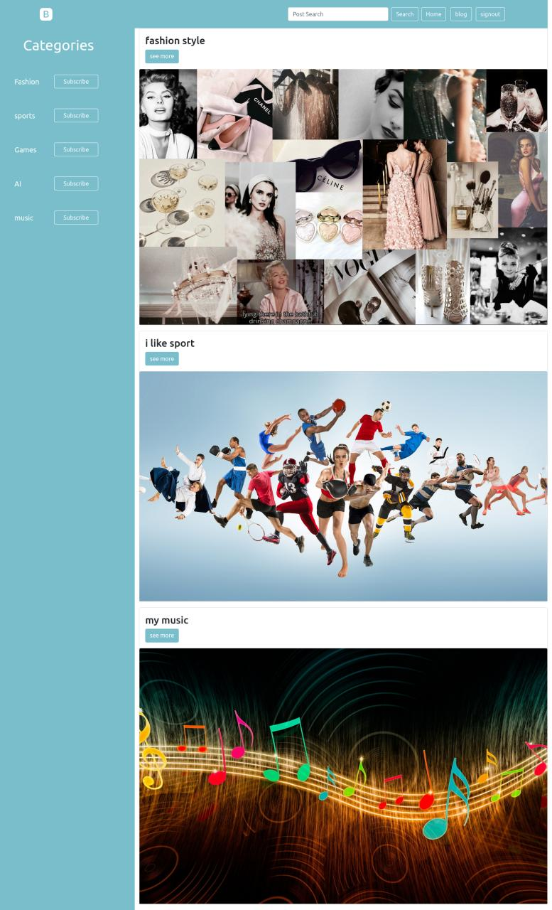
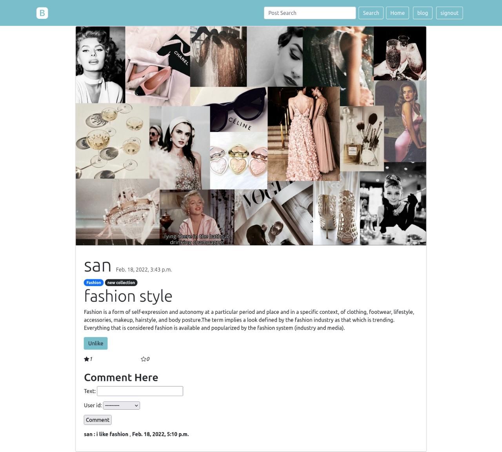
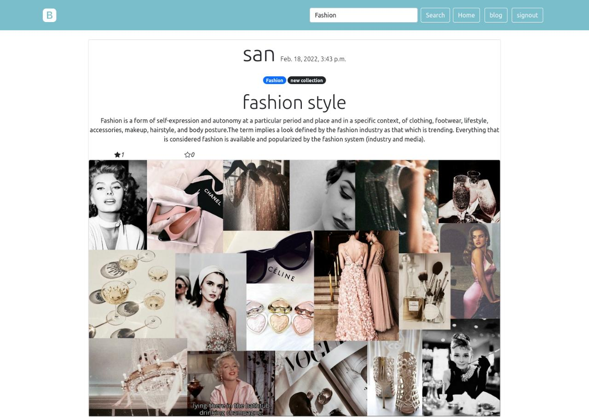
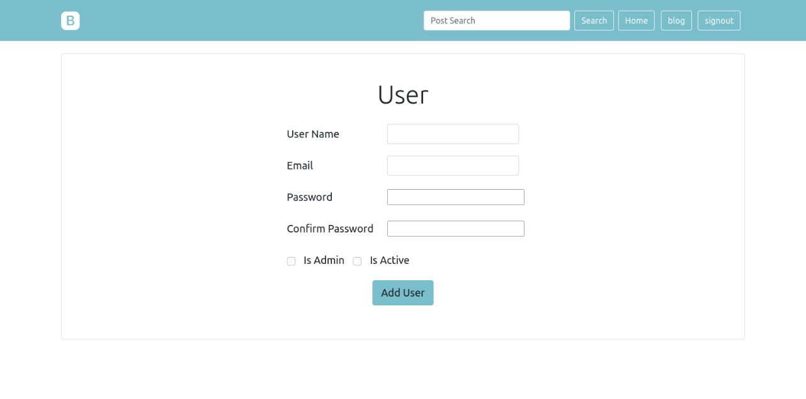
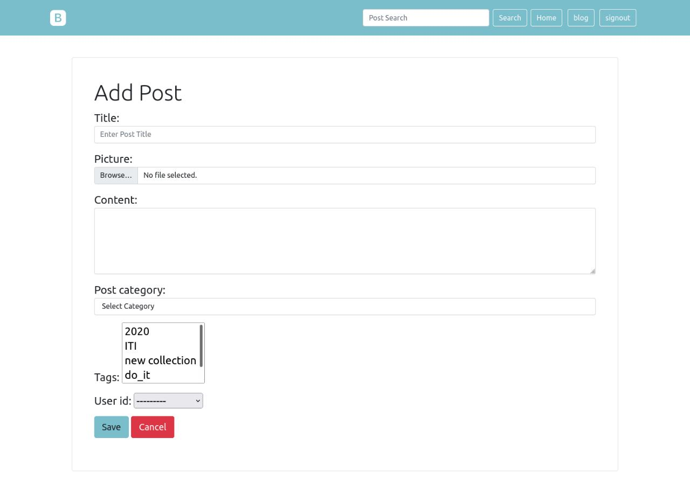
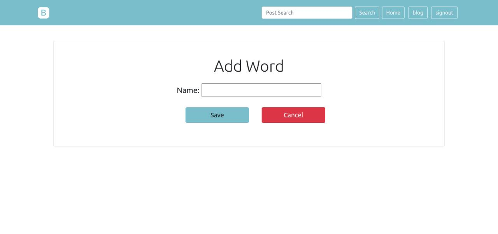
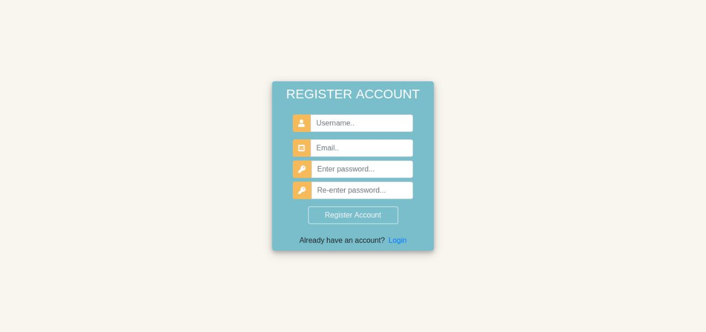
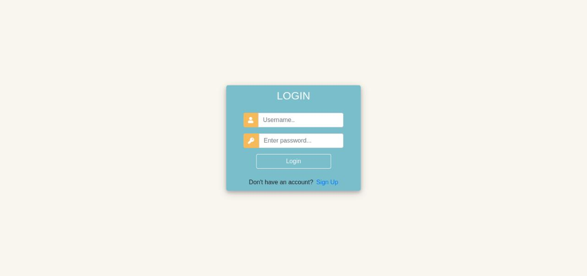

# Django Blog Project

<b>The project contain landing page that display all posts and categories</b>

- <b>you can see the details for each post in a separite page</b>
    - post content
    - post likes counter 
    - post comments
    - if you are user you can like or comment on post

- <b>you can search for any post with category or tag</b>

- <b>you can see the posts in each category</b>
    - you can subscribe and unsubscribe any category
- <b>if you are admin you are admin you can access blog page</b>
    - you can see , delete , edit and add :
        - user
        - post
        - category
        - forbidden word

- <b>finally your welcome to be one of our blog application</b>
    - you can register
    - and login our blog

### Contact Us

### Samah Gaber
[Github](https://github.com/samahgabermohamed)

[Linked in](https://www.linkedin.com/in/samah-gaber-62099b166)

### Sandra Girgis
[Github](https://github.com/sandra-girgis)

[Linked in](https://www.linkedin.com/in/sandra-girgis)

### Omar Akl
[Github](https://github.com/omartarekakl)

[Linked in](https://www.linkedin.com/in/omar-akl-a2185b203)

### Reem Shkeep
[Github](https://github.com/ReemShkeep)

[Linked in](https://www.linkedin.com/in/reem-shkeep/)

### Rehab Mohamed
[Github](https://github.com/Rehabmohamed19)

[Linked in](https://www.linkedin.com/in/rehab-mohamed-09a2ba219/)

### Youmna Samy
[Github](https://github.com/Youmna1798)

[Linked in](https://www.linkedin.com/in/youmna-samy/)